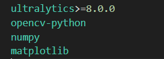
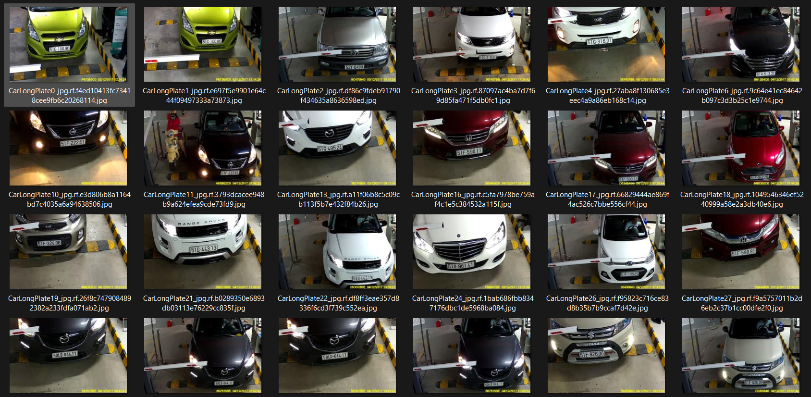
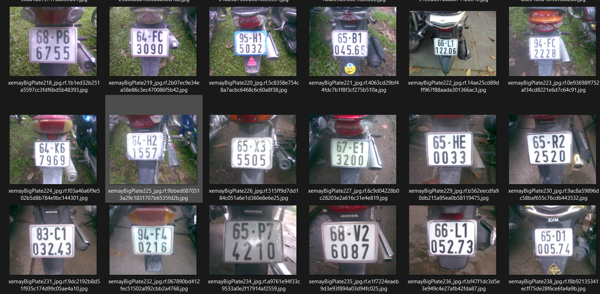
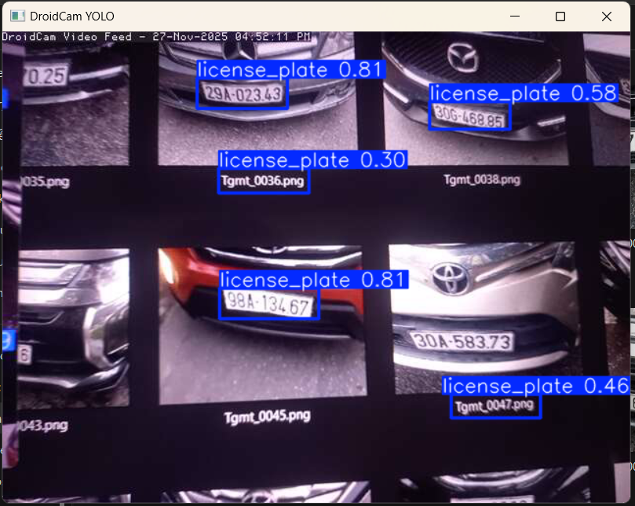

# LicensePlateDetection
Vietnam license plate detection project using YOLO

## Student: Nguyễn Bùi Quang Huy
- Student Code: 64130854
- From: Nha Trang University
- Facebook: [Nguyen Bui Quang Huy](https://www.facebook.com/nguyen.bui.quang.huy.491359/)
- Email: huybui2108@gmail.com

# Tutorial
# Virtual venv:

# Library: pip install -r requirements.txt

# Dataset: Icluding image from Roboflow

# Perform: Using DroidCam to connect with Laptop's Camera to Android Camera
